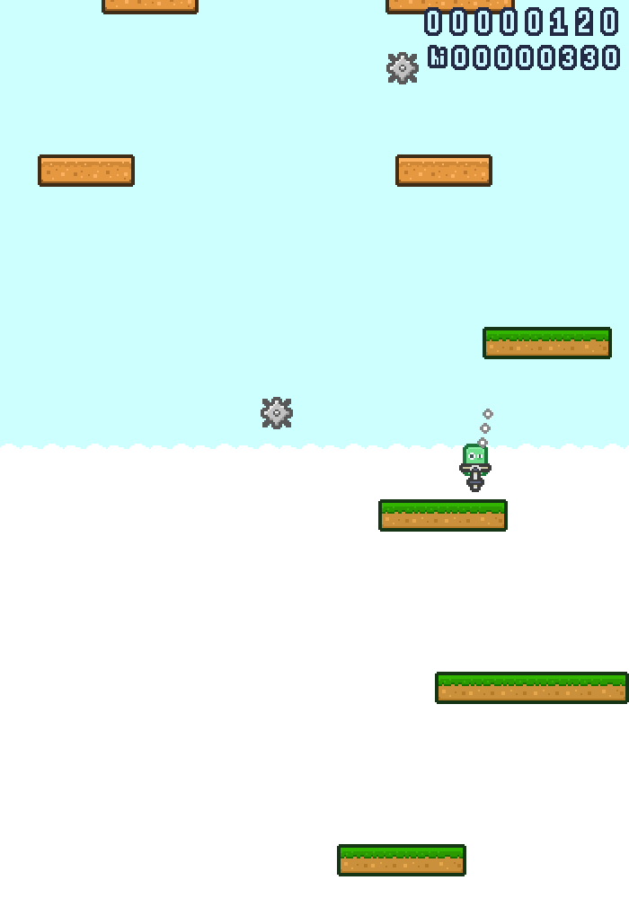
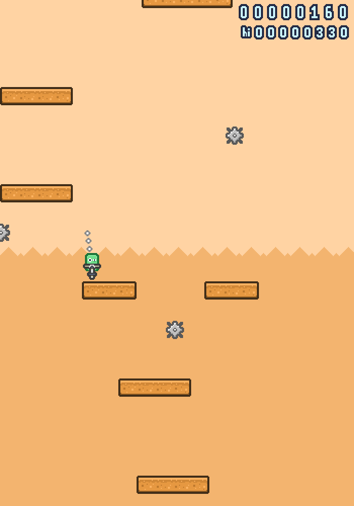

# Space Pogo

Play solo or in duo by jumping on the ledges using a space pogo through four visually different and procedurally generated worlds. It's a first game made in GMS by us and sometimes the procedural map generator may be a bit harsh though. Anyway, thanks for checking the game out!

Game made for [Opera GX Game Jam](https://gamejolt.com/c/gamemaker/ogxgj).

**Controls:**
 Player 1 - Arrows, space bar, mouse buttons - Jump
 Player 2 - W, A, S, D keys - Jump

**Credits:**
 Programming and Sound Effects - [Konrad Nowakowski](https://github.com/lethiandev) (me)
 Graphics - [Jakub Nowakowski](https://github.com/JudynGraff)

## Screenshots

